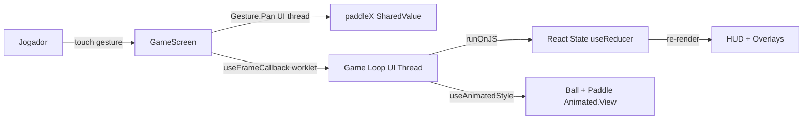

# TechSpec: KingPong — Feature 1: Tela de Jogo

**Versão:** 1.0
**Data:** 2026-05-30
**Autor:** Thiago Cavalcante
**PRD de referência:** docs/prd/kingpong-feature-1-prd.md
**Status:** Draft

---

## 1. Visão Técnica

### 1.1 Resumo da Solução

`GameScreen` única renderizada diretamente no launch (sem menu intermediário). Toda a física de jogo (posição da bola, velocidade, colisões) roda em worklets no UI thread via Reanimated 3 `useFrameCallback`, garantindo 60 FPS sem depender do JS thread. Gestos do paddle são capturados via `react-native-gesture-handler` (`Gesture.Pan`) e propagam diretamente para `useSharedValue` no UI thread. Estado de jogo (pontuação, vidas, enum de estado) é gerenciado via `useReducer` no React, atualizado a partir de worklets via `runOnJS`.

### 1.2 Diagrama de Contexto (C4 Nível 1)



### 1.3 Stack Tecnológica

| Camada | Tecnologia | Versão | Justificativa |
|--------|-----------|--------|---------------|
| Linguagem | TypeScript | 5.x | strict mode — guidelines |
| Framework | React Native CLI | 0.73+ | Guideline do projeto; controle total do código nativo |
| Animação / Física | react-native-reanimated | 3.x | Worklets no UI thread; 60 FPS sem JS thread |
| Gestos | react-native-gesture-handler | 2.x | Par natural do Reanimated 3; gestos no UI thread (≤ 16ms) |
| Testes | Detox | latest | E2E — guideline do projeto |
| Banco de dados | — | — | Nenhum — feature sem persistência |
| Backend / API | — | — | Nenhum — jogo offline |

---

## 2. Arquitetura

### 2.1 Padrão Arquitetural

Feature-based (alinhado com `guidelines/architecture.md`). A feature `game/` é autocontida: toda lógica de gameplay vive em hooks específicos. O `GameScreen.tsx` orquestra os hooks sem conter lógica de negócio diretamente.

**Separação de responsabilidades:**

| Thread | Responsável por | Mecanismo |
|--------|----------------|-----------|
| UI thread | Posição da bola, velocidade, colisões, posição do paddle | Reanimated `useSharedValue` + `useFrameCallback` |
| JS thread | Score, vidas, `GameState` enum, overlays, HUD | React `useReducer` |
| Comunicação UI → JS | Eventos de gol e vida perdida | `runOnJS` |
| Comunicação JS → UI | Ativar/pausar game loop, reset de posição | `useSharedValue` lido pelo worklet |

### 2.2 Estrutura de Pastas e Módulos

```
src/
├── features/
│   └── game/
│       ├── components/
│       │   ├── Ball.tsx               # Animated.View — posição via useAnimatedStyle
│       │   ├── GameBoard.tsx          # Container da área de jogo (bordas, goal zone)
│       │   ├── GameOverOverlay.tsx    # Overlay de game over (score final + "play again")
│       │   ├── GoalZone.tsx           # Marcação visual da goal zone
│       │   ├── HUD.tsx                # Score e vidas (re-renderiza via React state)
│       │   ├── LaunchOverlay.tsx      # Overlay de pre-launch (vidas + botão variável)
│       │   └── Paddle.tsx             # Animated.View — posição via useAnimatedStyle
│       ├── hooks/
│       │   ├── useGameLoop.ts         # useFrameCallback — física, colisões, detecção
│       │   ├── useGameState.ts        # useReducer — score, lives, gameState, launchLabel
│       │   └── usePaddleControl.ts    # Gesture.Pan — controle analógico do paddle
│       ├── screens/
│       │   └── GameScreen.tsx         # Tela principal — orquestra hooks e componentes
│       ├── constants.ts               # Todas as constantes UPPER_SNAKE_CASE
│       └── types.ts                   # Tipos TypeScript da feature
├── shared/
│   └── ...
└── App.tsx                            # GestureHandlerRootView + GameScreen
```

### 2.3 Fluxo de Dados por Caso de Uso

#### Fluxo: RF-001 — Renderização Inicial (LAUNCHING)

```
1. App.tsx → GameScreen: renderiza
2. GameScreen: useGameState() → { gameState: 'LAUNCHING', score: 0, lives: 3, launchLabel: 'iniciar' }
3. GameScreen: inicializa shared values (ballX=center, ballY=BALL_START_Y, paddleX=center)
4. GameScreen → LaunchOverlay: renderiza com lives=3, label="iniciar"
5. useFrameCallback: isActive=false (não inicia game loop)
```

**Tratamento de falha:** nenhum estado externo depende desta renderização; falha → tela em branco (React ErrorBoundary).

#### Fluxo: RF-002 — Controle do Paddle

```
1. Jogador: inicia arrasto no Footer (GestureDetector)
2. Gesture.Pan.onChange (UI thread): translationX → paddleX.value += translationX * PADDLE_SENSITIVITY
3. Clamp: paddleX.value = clamp(paddleX.value, PADDLE_MIN_X, PADDLE_MAX_X)
4. Paddle.tsx → useAnimatedStyle: translateX(paddleX.value) — re-renderiza no UI thread
```

**Tratamento de falha:** gesto iniciado fora do Footer → `hitSlop` zerado, GestureDetector rejeita; overlay ativo → `enabled={gameState === 'PLAYING'}` desativa o Gesture.Pan.

#### Fluxo: RF-003 — Game Loop / Física da Bola

```
1. useFrameCallback({ timeSincePreviousFrame }) [UI thread, ~60fps]:
   a. dt = timeSincePreviousFrame / 1000              // ms → s
   b. nextX = ballX.value + vx.value * dt
   c. nextY = ballY.value + vy.value * dt

   d. Colisão borda lateral (nextX ± BALL_RADIUS ≥/≤ limites):
      vx.value *= -1; nextX ajustado para dentro dos limites

   e. Colisão borda superior (nextY - BALL_RADIUS ≤ 0):
      vy.value *= -1; nextY = BALL_RADIUS

   f. Colisão paddle (hitbox ball × paddle rect):
      vy.value = -abs(vy.value)                       // inverte vertical
      impactRatio = (ballX - paddleX) / (PADDLE_WIDTH / 2)  // -1 a +1
      angle = lerp(BALL_BOUNCE_ANGLE_CENTER, BALL_BOUNCE_ANGLE_EDGE, abs(impactRatio))
      vx.value = sign(impactRatio) * speed * cos(angle)
      vy.value = -speed * sin(angle)
      speed = min(speed + BALL_SPEED_INCREMENT_PADDLE, BALL_SPEED_MAX)

   g. Interseção goal zone (ball hitbox ∩ goal zone rect):
      se inGoalZone.value === false:
        inGoalZone.value = true
        runOnJS(onGoalScored)()
        speed = min(speed + BALL_SPEED_INCREMENT_GOAL, BALL_SPEED_MAX)
      (quando ball sai da goal zone: inGoalZone.value = false)

   h. Borda inferior (nextY + BALL_RADIUS ≥ GAME_AREA_HEIGHT):
      se lifeLostLock.value === false:
        lifeLostLock.value = true
        ballY.value = GAME_AREA_HEIGHT + BALL_FREEZE_OFFSET
        isGameActive.value = false
        runOnJS(onLifeLost)()

   i. ballX.value = nextX; ballY.value = nextY
```

**Tratamento de falha:** `lifeLostLock.value` previne duplo decremento no mesmo frame.

#### Fluxo: RF-004 — Goal Zone (pass-through)

```
1. Game Loop detecta interseção (passo g acima)
2. inGoalZone.value: false → true ao entrar, true → false ao sair
3. Ponto marcado apenas na transição false→true (primeira interseção)
4. Trajetória da bola NÃO é alterada (sem reflexão)
```

**Tratamento de falha:** bola em alta velocidade — `BALL_SPEED_MAX = 500 px/s` garante ≤ 8.3 px/frame; com raio = 10px, a bola nunca atravessa a goal zone (altura = 20px) sem interseção em pelo menos 1 frame.

#### Fluxo: RF-005 / RF-006 — Vida Perdida / Game Over

```
1. onLifeLost() [JS thread via runOnJS]:
   a. dispatch({ type: 'LIFE_LOST' })
   b. Reducer: lives - 1
      → lives ≥ 1: gameState = 'LAUNCHING', launchLabel = 'continuar'
      → lives = 0: gameState = 'GAME_OVER'
2. useEffect [GameScreen] observa gameState:
   → LAUNCHING: LaunchOverlay renderizado; isGameActive.value = false
   → GAME_OVER:  GameOverOverlay renderizado; isGameActive.value = false

3. onGoalScored() [JS thread]:
   dispatch({ type: 'SCORE' }) → score + 1
```

**Tratamento de falha:** `lifeLostLock.value` (shared value boolean) garante que `onLifeLost` só é chamado uma vez por evento.

#### Fluxo: RF-008 — Overlay de Pre-Launch → Lançamento

```
1. Jogador: toca botão no LaunchOverlay (debounce 300ms)
2. dispatch({ type: 'START_PLAY' }) → gameState = 'PLAYING'
3. GameScreen: resetBall() — ballX=center, ballY=BALL_START_Y, sorteia ângulo [30°, 150°]
4. isGameActive.value = true → useFrameCallback ativa
5. lifeLostLock.value = false → reset do lock
6. LaunchOverlay desmontado (gameState !== 'LAUNCHING')
```

### 2.4 Decisões de Arquitetura (ADRs)

#### ADR-001: Reanimated 3 como engine de física

- **Contexto:** RNF-001 exige 60 FPS estáveis. O JS thread do React Native tem latência variável.
- **Decisão:** Todo cálculo de posição, velocidade e colisão roda em worklets no UI thread via `useFrameCallback`.
- **Alternativas consideradas:** Animated API nativa (interpolações apenas, sem lógica condicional); `requestAnimationFrame` no JS thread (~5–10 ms de latência extra pelo bridge).
- **Consequências:** `runOnJS` obrigatório para toda comunicação worklet→React. Debugging via Flipper + Reanimated DevTools. Adiciona dependência `react-native-reanimated`.

#### ADR-002: react-native-gesture-handler para controle do paddle

- **Contexto:** RNF-002 exige latência ≤ 16ms. `PanResponder` nativo passa pelo JS bridge.
- **Decisão:** `Gesture.Pan()` de RNGH — executa no UI thread, integra nativamente com Reanimated 3 shared values.
- **Alternativas consideradas:** `PanResponder` (JS thread, ≥ 16ms de latência adicional).
- **Consequências:** `GestureHandlerRootView` obrigatório no root do app. Adiciona dependência `react-native-gesture-handler`.

#### ADR-003: useReducer local para estado de jogo (sem Zustand)

- **Contexto:** `architecture.md` tem TODO para estado global. Feature tem uma única tela (`GameScreen`).
- **Decisão:** `useReducer` no `GameScreen.tsx` para score, lives, gameState e launchLabel. Sem biblioteca externa de estado.
- **Alternativas consideradas:** Zustand (overhead desnecessário para uma tela); Context API (re-renders em todos os consumidores sem seleção granular).
- **Consequências:** Estado encapsulado na feature. Adequado para o escopo atual. Se features futuras (ranking, achievements) precisarem ler estado de gameplay, extrai-se para Zustand naquele momento.

#### ADR-004: Detecção de colisão frame-by-frame (sem swept detection)

- **Contexto:** PRD menciona risco de tunneling. `BALL_SPEED_MAX = 500 px/s` → ≤ 8.3 px/frame a 60fps. Raio da bola = 10px.
- **Decisão:** Detecção simples por frame. O cap de velocidade garante que a bola nunca mova mais que o próprio raio por frame, tornando tunneling impossível.
- **Alternativas consideradas:** Swept detection completo (desnecessário para a velocidade máxima definida, adiciona complexidade).
- **Consequências:** Implementação significativamente mais simples. Se `BALL_SPEED_MAX` for aumentado além de 600 px/s em versões futuras, swept detection será necessário.

---

## 3. Modelagem de Dados

> **Artefato standalone:** [`docs/techspec/kingpong-feature-1/data-model.md`](kingpong-feature-1/data-model.md)

> **Nota:** Feature sem persistência. Toda modelagem é in-memory (in-process state).

### 3.1 Estado React (JS Thread)

```typescript
// types.ts

type GameState = 'LAUNCHING' | 'PLAYING' | 'LIFE_LOST' | 'GAME_OVER'
type LaunchLabel = 'iniciar' | 'continuar' | 'reiniciar'

interface GameStatus {
  gameState: GameState
  score: number
  lives: number
  launchLabel: LaunchLabel
}

type GameAction =
  | { type: 'START_PLAY' }
  | { type: 'SCORE' }
  | { type: 'LIFE_LOST' }
  | { type: 'GAME_OVER' }
  | { type: 'PLAY_AGAIN' }
```

**Reducer — Transições de estado:**

| Action | gameState antes | gameState depois | Efeitos colaterais |
|--------|----------------|------------------|--------------------|
| `START_PLAY` | `LAUNCHING` | `PLAYING` | — |
| `SCORE` | `PLAYING` | `PLAYING` | score + 1 |
| `LIFE_LOST` (lives ≥ 1) | `PLAYING` | `LAUNCHING` | lives - 1, launchLabel = 'continuar' |
| `LIFE_LOST` (lives = 1) | `PLAYING` | `GAME_OVER` | lives = 0 |
| `PLAY_AGAIN` | `GAME_OVER` | `LAUNCHING` | score = 0, lives = 3, launchLabel = 'reiniciar' |

### 3.2 Estado de Física (UI Thread — Reanimated SharedValues)

| SharedValue | Tipo | Descrição |
|-------------|------|-----------|
| `ballX` | `number` | Posição X do centro da bola (px a partir da borda esquerda da game area) |
| `ballY` | `number` | Posição Y do centro da bola (px a partir do topo da game area) |
| `vx` | `number` | Velocidade horizontal da bola (px/s; positivo = direita) |
| `vy` | `number` | Velocidade vertical da bola (px/s; positivo = baixo) |
| `paddleX` | `number` | Posição X do centro do paddle (px) |
| `isGameActive` | `boolean` | Controle do useFrameCallback (true = PLAYING) |
| `inGoalZone` | `boolean` | Flag de travessia da goal zone (pontuação única por passagem) |
| `lifeLostLock` | `boolean` | Debounce de vida perdida (previne duplo disparo no mesmo frame) |

### 3.3 Constantes de Jogo

**Arquivo:** `src/features/game/constants.ts`

```typescript
// Bola
export const BALL_RADIUS = 10
export const BALL_START_Y = 30                    // px a partir do topo da game area
export const INITIAL_BALL_SPEED = 20              // px/s — velocidade inicial
export const BALL_SPEED_INCREMENT_PADDLE = 5      // px/s por rebate no paddle ⚠️ calibrar
export const BALL_SPEED_INCREMENT_GOAL = 3        // px/s por ponto ⚠️ calibrar
export const BALL_SPEED_MAX = 500                 // px/s — cap
export const BALL_LAUNCH_ANGLE_MIN = 30           // graus (eixo horizontal positivo = 0°)
export const BALL_LAUNCH_ANGLE_MAX = 150          // graus
export const BALL_FREEZE_OFFSET = 10              // px abaixo da borda inferior ao congelar

// Paddle
export const PADDLE_WIDTH = 60
export const PADDLE_HEIGHT = 15
export const PADDLE_Y_OFFSET = 20                 // px acima da borda inferior da game area
export const PADDLE_SENSITIVITY = 1.0             // 1:1 drag → movement ⚠️ calibrar

// Ângulos de rebate (worklet usa radianos — converter com Math.PI/180)
export const BALL_BOUNCE_ANGLE_CENTER = 80        // graus — rebate central (quase reto)
export const BALL_BOUNCE_ANGLE_EDGE = 20          // graus — rebate nas extremidades ⚠️ calibrar

// Goal Zone
export const GOAL_ZONE_WIDTH = 60
export const GOAL_ZONE_HEIGHT = 20
// GOAL_ZONE_Y calculado em runtime: gameAreaHeight / 2 - GOAL_ZONE_HEIGHT / 2

// Layout (razões relativas à safe area height)
export const HEADER_HEIGHT_RATIO = 0.08
export const FOOTER_HEIGHT_RATIO = 0.22
// GAME_AREA_HEIGHT_RATIO = 0.70 (implícito: 1 - 0.08 - 0.22)

// Cores
export const COLOR_CRT_GREEN = '#00FF41'
export const COLOR_BG_GAME = '#0A0A0A'
export const COLOR_BG_HEADER = '#1A1A1A'
export const COLOR_BG_FOOTER = '#111111'
export const COLOR_BALL = '#FFFFFF'
export const COLOR_GOAL_ZONE_FILL = 'rgba(0, 255, 65, 0.12)'
export const COLOR_GOAL_ZONE_BORDER = '#00FF41'

// UX
export const LAUNCH_BUTTON_DEBOUNCE_MS = 300
```

### 3.4 Estratégia de Migrations

Não aplicável — sem banco de dados nesta feature.

---

## 4. Especificação de APIs

> **Contratos standalone:** [`docs/techspec/kingpong-feature-1/contracts/`](kingpong-feature-1/contracts/)

> **Nenhuma interface de API externa.** Jogo offline sem comunicação com serviços externos. Contratos não gerados — a feature utiliza apenas comunicação interna entre threads via Reanimated (`runOnJS`, `useSharedValue`).

---

## 5. Segurança

### 5.1 Autenticação
Não aplicável — sem usuários ou autenticação.

### 5.2 Autorização
Não aplicável.

### 5.3 Proteção de Dados

Nenhum dado sensível coletado, armazenado ou transmitido. Feature sem persistência.

### 5.4 Validação e Sanitização de Entrada

- Inputs do jogador são exclusivamente gestos touch — sem input de texto ou dados externos
- Posições da bola e paddle limitadas por `clamp()` nos worklets para prevenir estados fora dos bounds
- `BALL_SPEED_MAX` previne overflow de velocidade
- Botão de lançamento com debounce (`LAUNCH_BUTTON_DEBOUNCE_MS`) previne double-fire
- `lifeLostLock` previne duplo decremento de vida no mesmo frame

### 5.5 Auditoria
Não aplicável.

---

## 6. Integrações Externas

Nenhuma — jogo offline. Não há integração com APIs, SDKs analíticos ou serviços de terceiros.

---

## 7. Performance e Escalabilidade

### 7.1 Estratégia de Cache

| O que | TTL | Invalidação | Tecnologia |
|-------|-----|-------------|-----------|
| Dimensões da tela | Vida do componente | Re-mount | `useWindowDimensions` (RN built-in) |

### 7.2 Game Loop e Física

O game loop é executado via `useFrameCallback` (Reanimated 3, UI thread):

```typescript
useFrameCallback(({ timeSincePreviousFrame }) => {
  'worklet'
  if (!isGameActive.value) return
  const dt = (timeSincePreviousFrame ?? 16) / 1000 // ms → s; fallback 16ms
  // ... física determinística baseada em dt
}, true)
```

- `timeSincePreviousFrame` garante física independente de frame rate (delta time)
- Frame callback desativado (`isActive = false`) nos estados `LAUNCHING` e `GAME_OVER`
- Todos os cálculos são síncronos dentro do worklet; sem async/await

### 7.3 Otimizações de Renderização

- `useAnimatedStyle` para `Ball` e `Paddle` — updates diretos no UI thread, zero re-render React
- `HUD.tsx` com `React.memo` — re-renderiza apenas quando score ou lives mudam
- Overlays montados/desmontados condicionalmente (não `opacity: 0` com componente montado)
- `GestureHandlerRootView` no root do app (`App.tsx`) para RNGH funcionar corretamente
- Dimensões da game area calculadas uma vez no mount via `useWindowDimensions` e passadas como props

---

## 8. Observabilidade

### 8.1 Logs

Seguindo `guidelines/observability.md` — apenas `console.log` em `__DEV__`:

```typescript
if (__DEV__) {
  console.log('[GameState]', newState)
  console.log('[LifeLost] lives remaining:', newLives)
  console.log('[GameOver] final score:', score)
  console.log('[Launch] angle:', angleDeg, 'vx:', initialVx, 'vy:', initialVy)
}
```

Zero logs em produção para eventos de gameplay.

### 8.2 Métricas (Desenvolvimento)

| Métrica | Meta | Ferramenta |
|---------|------|-----------|
| Frame rate | ≥ 60 FPS em 95% dos frames | RN Performance Monitor / Flipper |
| Latência do paddle | ≤ 16ms do touch ao update visual | Systrace / inspeção manual |
| Worklet execution time | < 5ms por frame | Reanimated DevTools |
| Frame rate em device low-end | ≥ 30 FPS | Dispositivo físico Android 10+ / 2GB RAM |

### 8.3 Rastreabilidade

Não aplicável — sem requests externos ou usuários identificáveis.

---

## 9. Estratégia de Testes

### 9.1 Pirâmide de Testes

| Tipo | Ferramenta | Cobertura | O que cobre |
|------|-----------|-----------|-------------|
| E2E | Detox | 90% dos fluxos críticos | Fluxos de gameplay ponta a ponta em dispositivo/simulador real |

> Testes unitários de worklets Reanimated 3 não são executáveis em ambiente Jest/Node.js sem mock profundo. A cobertura de lógica de física é garantida pelos E2E.

**Estrutura dos arquivos de teste:**
```
tests/
└── e2e/
    └── gameplay.e2e.ts    # Todos os fluxos desta feature
```

### 9.2 Cenários de Teste Críticos por Requisito

**IDs de teste obrigatórios (`testID`) nos componentes:**

| testID | Componente | Uso |
|--------|-----------|-----|
| `game-area` | GameBoard | Hit area do jogo |
| `paddle` | Paddle | Elemento do paddle |
| `ball` | Ball | Elemento da bola |
| `goal-zone` | GoalZone | Área da goal zone |
| `hud-score` | HUD | Texto do score |
| `hud-lives` | HUD | Texto das vidas |
| `launch-overlay` | LaunchOverlay | Container do overlay |
| `launch-button` | LaunchOverlay | Botão de lançamento |
| `launch-label` | LaunchOverlay | Texto do botão |
| `game-over-overlay` | GameOverOverlay | Container do overlay |
| `play-again-button` | GameOverOverlay | Botão play again |
| `final-score` | GameOverOverlay | Pontuação final exibida |
| `footer` | GameScreen | Zona de controle do paddle |

---

#### RF-001: Estrutura Visual

- **Happy path:** app inicia → três regiões visíveis → "KingPong" em texto verde no header
- **Borda:** orientação portrait mantida ao rotacionar dispositivo (sem landscape)

---

#### RF-002: Controle do Paddle

- **Happy path:** arrasto horizontal no footer → paddle se move proporcionalmente
- **Borda:** paddle na borda lateral permanece sem ultrapassar
- **Borda:** gesto iniciado fora do footer não move paddle
- **Falha:** overlay ativo → paddle bloqueado (sem movimento)

---

#### RF-003: Mecânica da Bolinha

- **Happy path:** bola lançada → se move diagonalmente → rebota em bordas laterais e superior
- **Happy path:** bola rebate no paddle → muda direção → velocidade incrementada
- **Borda:** colisão simultânea borda lateral + borda superior → ambos os componentes invertidos
- **Falha:** velocidade não ultrapassa `BALL_SPEED_MAX`

---

#### RF-004: Goal Zone

- **Happy path:** bola atravessa goal zone → score += 1 → trajetória não alterada
- **Borda:** bola passa em alta velocidade → ponto marcado exatamente 1× por travessia

---

#### RF-005 / RF-006: Vidas e Game Over

- **Happy path completo:** 3 vidas → bola cai → LaunchOverlay("continuar") → lançamento → 2 vidas → ... → 0 vidas → GameOverOverlay → "play again" → reset (score=0, lives=3, label="reiniciar") → LaunchOverlay
- **Falha:** duplo toque em "play again" → jogo reinicia apenas uma vez

---

#### RF-007: HUD

- **Happy path:** score e vidas visíveis e atualizados em tempo real
- **Borda:** HUD permanece visível atrás dos overlays (LAUNCHING e GAME_OVER)
- **Borda:** score com 5+ dígitos não quebra layout

---

#### RF-008: Overlay de Pre-Launch

- **Happy path:** primeira abertura → label "iniciar"
- **Happy path:** após perda de vida → label "continuar"
- **Happy path:** após "play again" → label "reiniciar"
- **Borda:** toque fora do botão → overlay permanece sem ação

---

## 10. Deploy e Infraestrutura

### 10.1 Ambientes

| Ambiente | Branch | Comando |
|----------|--------|---------|
| Development Android | feature/* | `npx react-native run-android` |
| Development iOS | feature/* | `npx react-native run-ios` |
| Produção | — | Não configurado nesta entrega |

### 10.2 Pipeline CI/CD

Não configurado (guideline: sem CI/CD por ora).

Sequência manual de qualidade antes de qualquer teste de gameplay:

```bash
# 1. Verificação de tipos
npx tsc --noEmit

# 2. Lint
npx eslint src/features/game/

# 3. E2E Android
npx detox test --configuration android.emu.debug

# 4. E2E iOS
npx detox test --configuration ios.sim.debug
```

### 10.3 Estratégia de Rollback

Não aplicável — sem deploy automatizado. Reverter via `git checkout` da branch anterior se necessário.

---

## 11. Áreas de Trabalho Identificadas

> Esta seção alimenta o skill `/tasks`.

| Área | Descrição | Complexidade | Dependências |
|------|-----------|-------------|-------------|
| Setup / Deps | Instalar e configurar Reanimated 3 + RNGH; `GestureHandlerRootView` no App.tsx; portrait-only no AndroidManifest / Info.plist | P | — |
| Constantes e tipos | `constants.ts` + `types.ts` (GameState, GameAction, LaunchLabel) | P | — |
| Layout da tela | `GameScreen.tsx` + `GameBoard.tsx` — proporções responsivas via `useWindowDimensions`; header, footer, game area | P | Setup |
| useGameState | `useReducer` com reducer de transição de estados; launchLabel derivado | M | Tipos |
| useGameLoop | `useFrameCallback` — movement, colisões borda, colisão paddle com ângulo, goal detection, borda inferior | G | Layout, Constantes |
| usePaddleControl | `Gesture.Pan` — clamp nos limites, bloqueio por `gameState`, sensitivity | M | Layout |
| Componentes visuais | `Ball`, `Paddle` (Animated), `GoalZone`, `HUD` (React.memo) | M | Layout, Constantes |
| Overlays | `LaunchOverlay` (3 labels, debounce), `GameOverOverlay` (score final, debounce) | M | useGameState |
| Integração (GameScreen) | Orquestrar todos os hooks; `useEffect` observando gameState; reset de posição; runOnJS callbacks | M | Todos acima |
| Testes E2E | Cenários Detox cobrindo todos os RFs (gameplay.e2e.ts) | G | Integração |

---

## 12. Questões Técnicas em Aberto

| # | Questão | Impacto | Responsável | Prazo |
|---|---------|---------|-------------|-------|
| 1 | Calibração das constantes de física (`BALL_SPEED_INCREMENT_PADDLE`, `BALL_SPEED_INCREMENT_GOAL`, `BALL_BOUNCE_ANGLE_EDGE`) — valores iniciais definidos no TechSpec, ajuste fino durante gameplay | Equilíbrio de dificuldade | Thiago Cavalcante | Durante implementação |
| 2 | Fonte CRT para header e HUD — fonte customizada requer configuração de assets nativa; alternativa: `fontFamily: 'monospace'` com cor verde | Fidelidade visual do estilo CRT | Thiago Cavalcante | Componentes visuais |
| 3 | `useSafeAreaInsets` (iOS notch / Android status bar) — header deve começar abaixo do safe area inset superior | Layout em dispositivos com notch | Thiago Cavalcante | Setup de layout |
| 4 | Comportamento ao retornar de background durante `LAUNCHING` — bola já está congelada; `AppState` listener pode ser necessário para reativar overlay se necessário | UX de retorno de background | Thiago Cavalcante | Integração |

---

## 13. Histórico de Revisões

| Versão | Data | Autor | Alterações |
|--------|------|-------|------------|
| 1.0 | 2026-05-30 | Thiago Cavalcante | Versão inicial |
