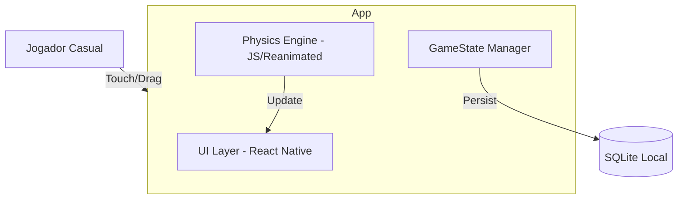
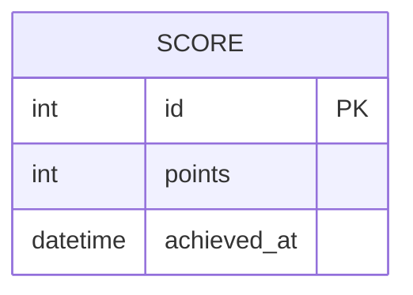

# TechSpec: KingPong Core Gameplay

**Versão:** 1.0
**Data:** 29/05/2026
**Autor:** thiago cavalcante
**PRD de referência:** [docs/prd/kingpong-core-gameplay-prd.md]
**Status:** Draft

---

## 1. Visão Técnica

### 1.1 Resumo da Solução
A solução consiste em uma aplicação React Native focada em alta performance de renderização para dispositivos móveis. Utilizaremos o `react-native-reanimated` para gerenciar a física e animações no thread de UI, minimizando o overhead da ponte JS. A arquitetura será baseada em funcionalidades (*feature-based*), isolando a lógica de motor de jogo em um núcleo (*core*) reutilizável.

### 1.2 Diagrama de Contexto (C4 Nível 1)



### 1.3 Stack Tecnológica

| Camada | Tecnologia | Versão | Justificativa |
|--------|-----------|--------|---------------|
| Mobile Framework | React Native | Latest | Conforme guidelines/stack.md |
| Linguagem | TypeScript | ^5.0 | Tipagem forte para lógica de vetores e física |
| Animação/Física | React Native Reanimated | ^3.0 | Execução no thread de UI para garantir 60 FPS (RNF-001) |
| Gestos | RN Gesture Handler | Latest | Captura de arraste de baixa latência para o Paddle |
| Estilização | StyleSheet (Native) | — | Performance nativa para layouts simples |
| Banco de dados | SQLite | Latest | Persistência local de recordes (guidelines) |

---

## 2. Arquitetura

### 2.1 Padrão Arquitetural
Adotaremos a **Feature-based Architecture** conforme definido em `guidelines/architecture.md`. A lógica matemática de colisão e movimento será isolada em uma camada `core/physics` para facilitar testes e manutenção sem dependência direta de componentes de UI.

### 2.2 Estrutura de Pastas e Módulos
```
src/
├── core/
│   ├── physics/         # Motores de colisão e cálculo vetorial
│   ├── constants/       # Cores (#83e509), tamanhos (bola, paddle)
│   └── hooks/           # useGameLoop, usePhysics
├── features/
│   ├── Game/
│   │   ├── components/  # Paddle, Ball, GoalArea, CRTOverlay
│   │   ├── hooks/       # usePaddleMovement
│   │   └── GameView.tsx # Tela principal
│   └── Modals/
│       └── components/  # StartModal, GameOverModal
├── shared/
│   ├── components/      # Header (50px), Footer (200px)
│   └── theme/           # Definição do verde-radioativo e blacks
└── database/            # Acesso ao SQLite (Score)
```

### 2.3 Fluxo de Dados por Caso de Uso

#### Fluxo: Movimentação da Bolinha (Saque)
```
1. Modal → GameState: Iniciar Rodada
2. usePhysics → BallState: Define posição inicial (20% topo) e vetor (20px/s, ângulo aleatório)
3. useGameLoop (Reanimated): Atualiza BallPosition x/y em cada frame (16.6ms)
4. UI Layer: Renderiza Ball usando SharedValue (zero bridge overhead)
```

#### Fluxo: Colisão Paddle
```
1. usePhysics: Detecta intersecção entre Hitbox da Bola e Hitbox do Paddle
2. usePhysics: Calcula novo vetor baseado no ponto de impacto (centro vs borda)
3. usePhysics: Aplica trava de 15 graus com a horizontal
4. GameState: Se impacto no limite inferior → Subtrai Vida
```

### 2.4 Decisões de Arquitetura (ADRs)

#### ADR-001: Uso de Reanimated para Motor de Física
- **Contexto:** Necessidade de garantir 60 FPS estáveis mesmo em dispositivos low-end (RNF-001, RNF-002).
- **Decisão:** Realizar o cálculo de translação (X, Y) da bola e do paddle via `SharedValues` e `useAnimatedStyle`.
- **Consequências:** A lógica de física deve ser escrita de forma compatível com o thread de UI (worklets), evitando chamadas frequentes para o thread principal de JS.

#### ADR-002: Layout Absoluto para Área de Jogo
- **Contexto:** Dimensões exatas solicitadas (Header 50px, Footer 200px, Goal 60px).
- **Decisão:** Utilizar posicionamento absoluto ou Flexbox rígido para garantir que as hitboxes matemáticas coincidam perfeitamente com a renderização visual.

---

## 3. Modelagem de Dados

> **Artefato standalone:** [`docs/techspec/kingpong-core-gameplay/data-model.md`](kingpong-core-gameplay/data-model.md)

### 3.1 Entidades e Relacionamentos
Para esta POC inicial, os dados de jogo residem majoritariamente em memória (estado volátil). A persistência em SQLite será focada na entidade `Score`.



---

## 4. Especificação de APIs

> **Contratos standalone:** [`docs/techspec/kingpong-core-gameplay/contracts/`](kingpong-core-gameplay/contracts/)

Nesta POC 100% offline, não existem endpoints REST externos. As "APIs" internas são interfaces de persistência local.

---

## 5. Segurança

### 5.1 Proteção de Dados
Toda a pontuação é armazenada localmente. Não há coleta de PII.

### 5.2 Validação de Entrada
A movimentação do paddle via gesto será limitada aos bounds da largura da tela no `core/physics` para evitar "fugida" do componente.

---

## 6. Performance e Escalabilidade

### 6.1 Otimização de Renderização
- **Scanlines:** O efeito CRT será implementado como um overlay estático (linhas fixas) e uma única animação linear de scanline (barra de 10px) usando `Native Driver` para consumo zero de CPU.
- **FPS Lock:** A física será desacoplada do frame rate através de delta-time (opcional para POC, mas recomendado se a velocidade inicial de 20px/s variar).

---

## 7. Estratégia de Testes

### 7.1 Pirâmide de Testes
| Tipo | Ferramenta | Cobertura Mínima | O que cobre |
|------|-----------|-----------------|-------------|
| Unitário | Jest | 80% | Cálculos de colisão em `core/physics` (refração de ângulos) |
| E2E | Detox | Fluxo Crítico | Abrir jogo, iniciar, marcar ponto, game over |

---

## 8. Áreas de Trabalho Identificadas

| Área | Descrição | Complexidade | Dependências |
|------|-----------|-------------|-------------|
| Setup / Infra | Configuração do projeto RN, Reanimated e Gesture Handler | P | — |
| Core Physics | Engine de colisão (trava 15°, bounce, goal detection) | G | Setup |
| UI Gameplay | Renderização Ball, Paddle (30% width), Goal (60px), CRT | M | Physics |
| Game State | Gestão de vidas (3), pontos e modais (Iniciar/GameOver) | M | UI |
| Persistência | Integração com SQLite para High Scores | P | Game State |

---

## 9. Questões Técnicas em Aberto

| # | Questão | Impacto | Responsável | Prazo |
|---|---------|---------|-------------|-------|
| 1 | Uso de Canvas (Skia) para renderização CRT? | Pode melhorar a performance mas aumenta complexidade do setup | thiago | 01/06/2026 |

---

## 10. Histórico de Revisões

| Versão | Data | Autor | Alterações |
|--------|------|-------|------------|
| 1.0 | 29/05/2026 | thiago cavalcante | Versão inicial |
