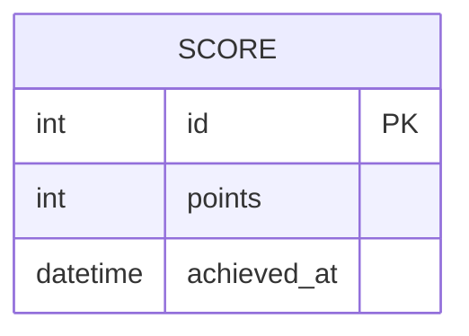

# Data Model: KingPong Core Gameplay

**TechSpec:** [docs/techspec/kingpong-core-gameplay-techspec.md — Seção 3](../kingpong-core-gameplay-techspec.md#3-modelagem-de-dados)
**Gerado em:** 29/05/2026

---

## Diagrama ER



---

## Entidades

### Score (Recordes)

| Campo | Tipo | Restrições | Descrição |
|-------|------|-----------|-----------|
| id | INTEGER | PK, AUTOINCREMENT | Identificador do registro |
| points | INTEGER | NOT NULL | Quantidade de pontos acumulados na partida |
| achieved_at | DATETIME | DEFAULT CURRENT_TIMESTAMP | Data e hora da conquista |

---

## Ciclo de Vida de Estados (Game State)

### Round State

```
PAUSED (Initial) → PLAYING → PAUSED (Life Lost) → GAME_OVER
```

| Estado | Transições permitidas | Condição / evento |
|--------|----------------------|-------------------|
| PAUSED | → PLAYING | Clique no botão "Iniciar" do Modal |
| PLAYING | → PAUSED | Bola ultrapassa limite inferior (Y > screen_height) |
| PAUSED | → GAME_OVER | Vidas == 0 |
| GAME_OVER | → PAUSED | Clique no botão "Reiniciar" (reseta vidas/pontos) |

---

## Estratégia de Migrations
Utilizaremos o driver nativo de SQLite do React Native. Como a estrutura é simplificada para a POC, a criação da tabela `scores` será executada no bootstrap do app caso não exista.
