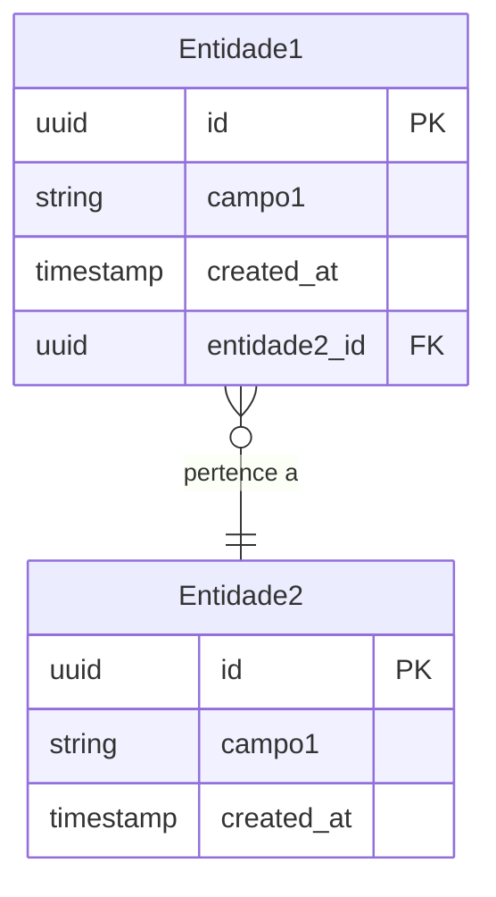

# Data Model: [Nome da Feature]

**TechSpec:** [docs/techspec/[nome]-techspec.md — Seção 3](../[nome]-techspec.md#3-modelagem-de-dados-resumo)
**Gerado em:** [data]

> **Este arquivo é a fonte de verdade da modelagem de dados** — o TechSpec contém apenas um resumo com link para cá.

---

## Diagrama ER

Prefira **Mermaid erDiagram** (renderiza no GitHub/GitLab/Obsidian):


Se Mermaid não for suportado, use pseudoERD textual:
```
Entidade1(id PK, campo1, entidade2_id FK, created_at, updated_at)
Entidade2(id PK, campo1, created_at, updated_at)
Entidade1 }o--|| Entidade2 : "pertence a"
```

---

## Entidades

### [NomeEntidade]

| Campo | Tipo | Restrições | Descrição |
|-------|------|-----------|-----------|
| id | UUID | PK, NOT NULL | Identificador único |
| [campo] | [tipo SQL] | [NOT NULL/UNIQUE/DEFAULT] | [Descrição e regra de negócio] |
| created_at | TIMESTAMP | NOT NULL, DEFAULT NOW() | Data de criação |
| updated_at | TIMESTAMP | NOT NULL | Data da última atualização |

**Índices:**
- `idx_[tabela]_[campo]` em ([campos]) — [justificativa de performance]

**Regras de integridade:**
- [Constraint de negócio — ex: status deve ser um dos valores: PENDING, ACTIVE, INACTIVE]

[Repetir para cada entidade]

---

## Ciclo de Vida de Estados

> Inclua apenas entidades que possuem transições de estado relevantes. Omitir esta seção se nenhuma entidade possuir máquina de estados.

### [Entidade com estados]

```
[estado inicial] → [estado A] → [estado final]
                 → [estado B]
```

| Estado | Transições permitidas | Condição / evento |
|--------|----------------------|-------------------|
| [estado] | [→ próximo estado] | [condição] |

---

## Estratégia de Migrations

[Ferramenta usada, convenção de nomenclatura, política de rollback, ordem de aplicação]
