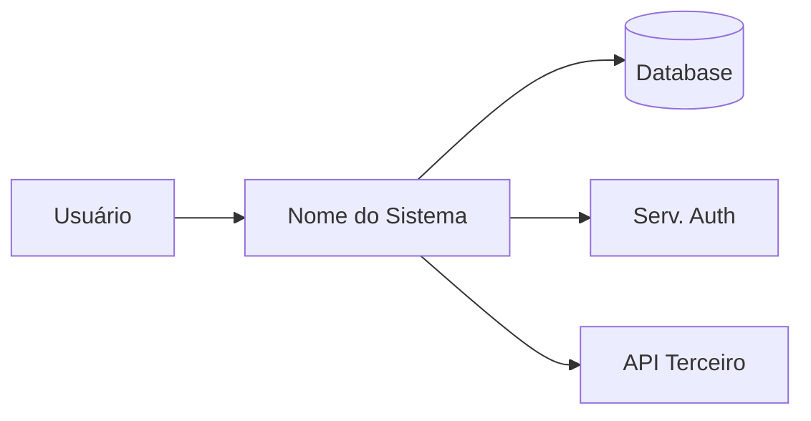

# TechSpec: [Nome do Projeto/Feature]

**Versão:** 1.0
**Data:** [data atual]
**Autor:** [nome coletado na FASE 1]
**PRD de referência:** [docs/prd/nome-do-arquivo-prd.md]
**Sistema:** [nome — systems/nome/ | omitir em workspace de sistema único]
**Contrato de integração:** [docs/contracts/nome-contract.md — somente em features multi-sistema; dependência imutável]
**Status:** Draft

> **Regra de escala:** seções não aplicáveis a esta feature recebem `N/A — [motivo]` em uma linha. Não preencha seções irrelevantes só para completar o template.

---

## 1. Visão Técnica

### 1.1 Resumo da Solução
[Descrição de alto nível da solução em no máximo 5 linhas. O "o quê" e "como" em linguagem técnica acessível. Contextualize em relação ao PRD.]

### 1.2 Diagrama de Contexto (C4 Nível 1)

Prefira **Mermaid** (renderiza no GitHub, GitLab, Obsidian e na maioria das ferramentas):


Se Mermaid não for suportado no ambiente, use ASCII art.

### 1.3 Stack Tecnológica
[Baseado nos guidelines do projeto — confirme ou especifique:]

| Camada | Tecnologia | Versão | Justificativa |
|--------|-----------|--------|---------------|
| Frontend | [tech] | [versão] | [alinhado com guidelines — motivo] |
| Backend | [tech] | [versão] | [motivo] |
| Banco de dados | [tech] | [versão] | [motivo] |
| Cache | [tech] | [versão] | [motivo — ou N/A] |
| Infraestrutura | [tech] | [versão] | [motivo] |
| Mensageria | [tech se aplicável] | [versão] | [motivo — ou N/A] |

---

## 2. Arquitetura

### 2.1 Padrão Arquitetural
[Descreva o padrão adotado (ex: Clean Architecture, Hexagonal, MVC, Event-Driven, CQRS) e justifique com base nos guidelines e nos requisitos do PRD.]

### 2.2 Estrutura de Pastas e Módulos
```
[Estrutura de diretórios esperada do projeto/feature, alinhada com os coding standards dos guidelines]
```

### 2.3 Fluxo de Dados por Caso de Uso

[Para cada RF principal do PRD, descreva o fluxo técnico]

#### Fluxo: [RF-001 — Nome]
```
1. [Ator/Origem] → [Componente]: [ação/chamada]
2. [Componente] → [Repositório/Serviço]: [operação]
3. [Repositório] → [Banco]: [query/comando]
4. [Banco] → [Repositório]: [resultado]
5. [Componente] → [Ator/Destino]: [resposta]
```
**Tratamento de falha:** [O que acontece em cada ponto de falha]

### 2.4 Decisões de Arquitetura (ADRs)

#### ADR-001: [Título da Decisão]
- **Contexto:** [Por que esta decisão precisou ser tomada]
- **Decisão:** [O que foi decidido]
- **Alternativas consideradas:** [Outras opções avaliadas e por que foram descartadas]
- **Consequências:** [Trade-offs e impactos desta decisão]

[Repetir ADR-XXX para cada decisão arquitetural relevante]

---

## 3. Modelagem de Dados (resumo)

> **Fonte de verdade:** [`docs/techspec/[nome]/data-model.md`]([nome]/data-model.md) — diagrama ER completo, definição de campos, índices, integridade, ciclo de vida de estados e estratégia de migrations. **Não duplique aqui o conteúdo do artefato.**

**Entidades:** [lista das entidades, uma linha cada: nome — papel no domínio — relacionamentos-chave]

**Decisões de modelagem relevantes:** [apenas o que um leitor do TechSpec precisa saber sem abrir o data-model — ex: soft delete, particionamento, multi-tenancy]

---

## 4. Especificação de APIs (resumo)

> **Fonte de verdade:** [`docs/techspec/[nome]/contracts/`]([nome]/contracts/) — um arquivo por recurso, com request/response/erros completos. **Não duplique aqui os contratos.**

### 4.1 Padrões e Convenções
[Referencie `guidelines/api-conventions.md` para envelope de resposta, códigos de status, versionamento, paginação e rate limiting. Documente aqui **apenas os desvios ou complementos** específicos desta feature. Se não houver guidelines, defina o envelope no primeiro arquivo de contrato e referencie-o.]

### 4.2 Índice de Endpoints

| Método | Rota | Descrição | RF | Contrato |
|--------|------|-----------|----|----------|
| POST | `/api/v1/[recurso]` | [uma linha] | RF-001 | [contracts/[recurso].md]([nome]/contracts/[recurso].md) |

[Uma linha por endpoint. Se a feature não tem API, escreva: `N/A — [motivo]`.]

---

## 5. Segurança

### 5.1 Autenticação
[Mecanismo (JWT, OAuth2, Session), fluxo, expiração e renovação de tokens, estratégia de revogação]

### 5.2 Autorização
[Modelo de permissões (RBAC, ABAC), papéis, regras de acesso por recurso e operação]

### 5.3 Proteção de Dados
[Dados sensíveis identificados no PRD: criptografia em trânsito/repouso, mascaramento em logs, retenção]

### 5.4 Validação e Sanitização de Entrada
[Estratégia de validação (schema validation), prevenção de SQL injection, XSS, CSRF — alinhado com guidelines]

### 5.5 Auditoria
[O que será auditado, formato do log de auditoria, retenção, acesso]

---

## 6. Integrações Externas

### 6.1 [Nome da Integração]
- **Tipo:** [REST / GraphQL / Webhook / Mensageria / Batch]
- **Autenticação:** [Como se autentica com o serviço externo]
- **Operações utilizadas:** [Lista de endpoints/ações consumidos]
- **Contrato de exemplo:** [request/response mínimos]
- **Tratamento de falha:** [Timeout, retry com backoff, circuit breaker, fallback]
- **SLA esperado:** [Tempo máximo aceitável de resposta]

[Repetir para cada integração — ou `N/A — sem integrações externas`]

---

## 7. Performance e Escalabilidade

### 7.1 Estratégia de Cache
| O que cachear | TTL | Estratégia de invalidação | Tecnologia |
|---------------|-----|--------------------------|-----------|
| [Dado/resposta] | [tempo] | [evento que invalida] | [Redis/etc] |

### 7.2 Processamento Assíncrono
[Filas, cenários async, garantias de entrega, idempotência — ou N/A]

### 7.3 Otimizações de Banco
[Índices críticos, paginação, connection pooling, read replicas se aplicável]

---

## 8. Observabilidade

### 8.1 Logs
- **Formato:** JSON estruturado
- **Campos obrigatórios:** `timestamp`, `level`, `service`, `requestId`, `userId` (quando autenticado), `action`
- **Níveis:** ERROR (falha com impacto), WARN (anômalo recuperável), INFO (fluxo normal relevante), DEBUG (diagnóstico)
- **O que NÃO registrar:** senhas, tokens, dados de cartão, dados pessoais sem mascaramento

### 8.2 Métricas
| Métrica | Tipo | Descrição | Alerta quando |
|---------|------|-----------|--------------|
| `[nome_metrica]` | Counter/Gauge/Histogram | [O que mede] | [Threshold] |

### 8.3 Rastreabilidade
[Correlation ID propagado, distributed tracing se aplicável]

---

## 9. Estratégia de Testes

### 9.1 Pirâmide de Testes
[Referenciando guidelines: ferramentas, cobertura mínima por tipo]

| Tipo | Ferramenta | Cobertura Mínima | O que cobre |
|------|-----------|-----------------|-------------|
| Unitário | [tool] | [%] | Regras de negócio, use cases |
| Integração | [tool] | [%] | Repositórios, serviços externos (mock/stub) |
| E2E / API | [tool] | Fluxos críticos | Contratos, fluxos ponta a ponta |
| Performance | [tool] | SLOs do PRD | Latência, throughput sob carga |

### 9.2 Cenários de Teste Críticos por Requisito

#### RF-001: [Nome]
- Happy path: [Cenário principal]
- Borda: [Casos limítrofes]
- Falha: [Comportamentos de erro esperados]

---

## 10. Deploy e Infraestrutura

### 10.1 Ambientes
| Ambiente | Propósito | Branch | URL |
|----------|-----------|--------|-----|
| Development | Desenvolvimento local | feature/* | localhost |
| Staging | Homologação | main | [URL] |
| Production | Produção | tags/v* | [URL] |

### 10.2 Pipeline CI/CD
[Stages: lint → unit → integration → SAST → build → deploy staging → E2E → deploy prod (gate manual)]

### 10.3 Estratégia de Rollback
[Feature flags, blue-green, canary, ou rollback de deploy]

---

## 11. Áreas de Trabalho Identificadas

> Esta seção alimenta o skill `/tasks`. Liste as grandes frentes de trabalho.

| Área | Descrição | Complexidade | Dependências |
|------|-----------|-------------|-------------|
| Setup / Infra | [Configurações iniciais] | P/M/G | — |
| Modelagem de dados | [Migrations e modelos] | P/M/G | Setup |
| Camada de domínio | [Entidades, regras de negócio] | P/M/G | Modelagem |
| Repositórios / DAL | [Acesso a dados] | P/M/G | Domínio |
| API / Controllers | [Endpoints especificados] | P/M/G | Repositórios |
| Integrações | [Serviços externos] | P/M/G | API |
| Frontend / UI | [Componentes e telas] | P/M/G | API |
| Testes | [Cobertura planejada] | P/M/G | Implementação |

---

## 12. Matriz de Rastreabilidade

> Âncora para `/analyze` e `/tasks`. **Todo RF e RNF do PRD deve aparecer aqui.** Um RF sem linha nesta matriz é um gap de especificação.

| Requisito (PRD) | Sistema | Seções do TechSpec | Artefatos | Cobertura de teste (9.2) |
|-----------------|---------|--------------------|-----------|--------------------------|
| RF-001 | [nome ou "—"] | [2.3, 4.2] | [contracts/[recurso].md, data-model.md] | [Sim/Parcial/Não] |
| RNF-001 | [nome ou "—"] | [7.x / 8.x] | [—] | [Sim/Parcial/Não] |

> Em features multi-sistema, um RF pode ter linhas em techspecs de sistemas diferentes — o conjunto dos techspecs deve cobrir todos os RFs. Coluna "Sistema" = "—" em workspace de sistema único.

---

## 13. Questões Técnicas em Aberto

| # | Questão | Impacto | Responsável | Prazo |
|---|---------|---------|-------------|-------|
| 1 | [Questão técnica não resolvida] | [Impacto se não resolvida] | [Quem] | [Data] |

---

## 14. Histórico de Revisões

| Versão | Data | Autor | Alterações |
|--------|------|-------|------------|
| 1.0 | [data] | [autor] | Versão inicial |
